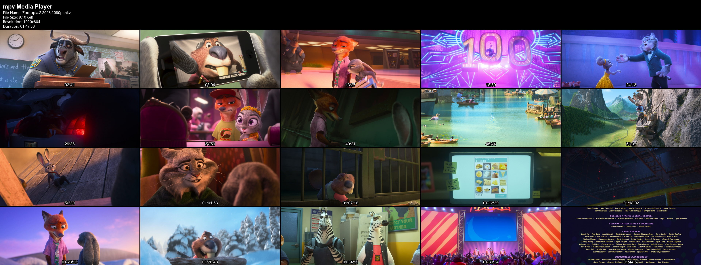

纯Vibe coding产物，面向yes编程
本人至今不懂代码，用大半天做了一个类似potplayer创建缩略图的功能
非常初级，不完善，没有算法，没有测试，仅测试在鄙人PC上
分享给有同需求的朋友们


简介如下：
# mpv-contact-sheet-LF

一款轻量级 **mpv** 联系表生成脚本，基于 **Lua + FFmpeg** 实现。

按下单个按键即可从当前播放的视频中生成可视化的联系表（缩略图网格）。


## 预览效果

生成的联系表包含视频信息页眉，下方为 5 × 4 的缩略图网格。




┌──────────────────────────────────────────────┐
│ mpv 媒体播放器                               │
│ 文件名：example.mp4                          │
│ 文件大小：1.25 GiB                          │
│ 分辨率：1920x1080                           │
│ 时长：01:23:45                              │
├──────────────────────────────────────────────┤
│   00:02    │   00:06    │   00:10    │ ...  │
│────────────┼────────────┼────────────┼──────│
│   00:14    │   00:18    │   00:22    │ ...  │
│────────────┼────────────┼────────────┼──────│
│   00:27    │   00:31    │   00:35    │ ...  │
│────────────┼────────────┼────────────┼──────│
│   00:39    │   00:43    │   00:47    │ ...  │
└──────────────────────────────────────────────┘
```


## 功能特点

* 借助mpv lua接口和ffmpeg直接从 mpv 生成联系表
* 从视频中提取 **20 个平均代表帧**
* 5 × 4 缩略图网格布局
* 可配置缩略图尺寸和网格间距
* 在页眉中显示视频信息


## 系统要求

* 仅Windows
* [mpv]
* [FFmpeg]
* 支持 Lua 脚本的 mpv 版本
* 字体：微软雅黑、arialbd
FFmpeg 必须为系统添加 `PATH` 环境变量


## 安装方法

将 Lua 脚本复制到 mpv 的 `scripts` 目录中。

对于标准版 mpv 安装，目录结构如下：

```
mpv/
├── mpv.exe
├── mpv.conf
└── scripts/
    └── contact-sheet.lua
```

启动 mpv 并打开一个视频文件即可。

## 使用方法

视频播放时，按下键盘上的：

[C] 键（默认）


## 工作原理

本项目采用简单的两阶段处理流程：

```
                 当前视频
                    │
                    ▼
                 mpv Lua
                    │
       ┌────────────┴────────────┐
       │                         │
       ▼                         ▼
  视频元数据                 采样时间点
       │                         │
       │                         ▼
       │                     FFmpeg
       │                         │
       │                    20 张 PNG 帧
       │                         │
       └────────────┬────────────┘
                    ▼
                 FFmpeg
                    │
       ┌────────────┴────────────┐
       │                         │
       ▼                         ▼
     页眉                       网格
       │                         │
       └────────────┬────────────┘
                    ▼
              联系表（最终图片）


注：没有避开黑帧算法，没有场景变化采样
仅最简单的平均中间帧采样


              
                    │
                    ▼
       example.mp4.contact-sheet.png
